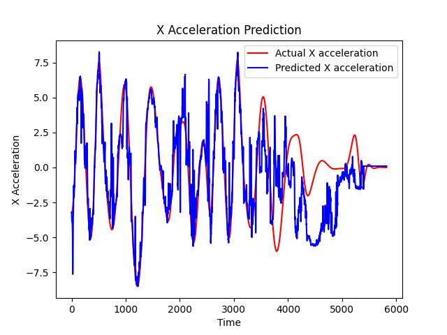
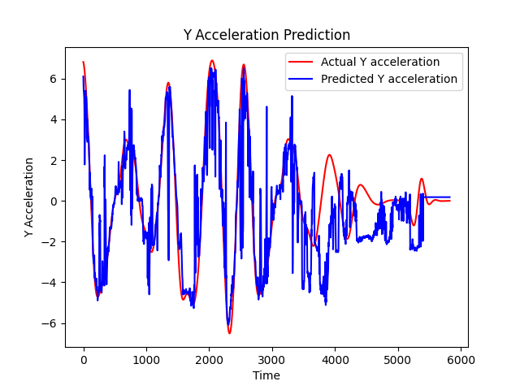
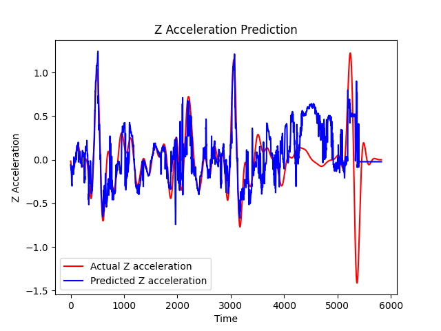

# Learned Acceleration Estimator

This is a personal project developed in order to validate the idea of replacing an IMU in drone racing to achieve similar performances in state estimation.
Disclaimer: this project is far from being optimized and will be further developed to actually be able to replace an IMU in the context of drone racing.

The idea behind the project is that an state-of-the-art odometry systems for drones don't take advantage of the previous control commands to estimate their current state. The classical way to do use this information is to use a dynamic model of the drone based on first principles to estimate the relation between control commands and acceleration, however, it ends up being fairly inaccurate because it can't take into account secondary aerodynamical effects. The proposed way to fix this issue is to take advantage of neural networks to learn the complexities of the model. Drone racing suits this application particularly well because the neural network can overfit to the track, eliminating the problem of having to generalize to many different situations.

## Data Preprocessing
The rpm data wasn't filtered at all because in a real-world scenario the system would use the real-time commandend inputs to make its estimate. However, it was resampled at exactly 180 Hz.
The ground truth acceleration data was derived from a discrete derivative of the ground truth position data. However, the position data was first filtered with a butterworth filter at 5Hz and then the velocity data with a 4th order butterworth filter at 1Hz. The reason for it is that without such filtering the S/N ratio of the acceleration signal would become extremely high. The final acceleration data wasn't filtered.

## Network Architecture
The network takes as input a buffer of the last ten commanded motor rpms and outputs the acceleration vector along its three axes.
With this being only an idea validation project, I chose to utilize a basic architecture: the network is a Recurrent Neural Network using 4 LSTM layers interleaved with Dropout layers for regularization, and ends with a Dense layer for output.
The network was trained on the first 70% of the track, 15% was used for validation, and the last 15% for testing. It was trained for 1000 epochs with a batch size of 32.

## Results
The results on the testing set are very promising, considering that the network architecture is very basic. The final part of the data, where the drone lands, is the least accurate because it never appears in the training data, showing the weakness of this model to generalize to different tracks. In a real application, the network would be trained on the full track and the validation and testing would be done on new runs of the same track, hence including takeoff and landing.
The results are very promising because this network could obtain acceleration data at a higher frequency than an IMU, since the RPM measurements are at 180Hz, while the IMU is sampled at 100 HZ.
Potential improvements could come from more advanced architectures and better hyperparameter tuning, in particular a promising architecture is a Temporal Convolutional Network (TCN).
Below are the results on the test set:

